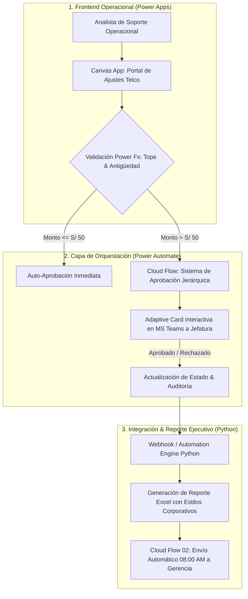

# ⚙️ Telecom Operations & Power Platform Automation Suite

[](https://powerapps.microsoft.com/)
[](https://powerautomate.microsoft.com/)
[](https://teams.microsoft.com/)
[](https://www.python.org/)
[](LICENSE)

> Proyecto personal de **Automatización de Procesos de Negocio (BPA)** y prueba de concepto (PoC) aplicada a operaciones post-facturación en telecomunicaciones, integrando **Power Apps (Canvas App), Power Automate (Cloud Flows), Tarjetas Adaptables en Microsoft Teams y procesamiento en Python**.

---

## 🎯 Contexto, Motivación & Planteamiento del Problema

En las operaciones masivas de soporte y post-facturación en empresas de telecomunicaciones, la gestión de reclamos por facturación e incidencias comerciales (cobros no reconocidos, errores de tarificación en roaming o paquetes no imputados) suele enfrentarse a cuellos de botella: cadenas manuales de correos para autorizar notas de crédito, dispersión de planillas locales y riesgo de error por digitación manual.

Como estudiante de pregrado en **Ingeniería de Sistemas y Bachiller en Ciencias (Matemática)** en la Universidad Nacional de Ingeniería (UNI), desarrollé este proyecto como una **Prueba de Concepto (PoC) de extremo a extremo**. El objetivo es explorar y demostrar cómo la combinación de herramientas **Low-Code empresariales (Power Platform)** y **lenguajes de programación (Python)** permite modelar, validar y optimizar un flujo de trabajo operacional de alta exigencia.

### 📊 Simulación de Eficiencia Operativa (Validación de la PoC)

Para evaluar el impacto de la arquitectura propuesta, se simuló un entorno operacional utilizando datasets de prueba estructurados en ciclos de corte (`C01`, `C15`, `C28`):

| Dimensión Evaluada | Enfoque Manual Tradicional | Solución Diseñada (PoC) | Beneficio Observado en Pruebas |
| :--- | :--- | :--- | :--- |
| **Tiempo de Decisión en Ajustes** | Varios días en bandejas de correo | **Notificación interactiva en Teams** | **⚡ Decisión ágil (< 15 min en pruebas)** sin salir del entorno de colaboración |
| **Integridad de Datos & Reglas** | Revisión manual sujeta a error | **Lógica reactiva con Power Fx** | **🛡️ 100% de consistencia:** bloquea montos que excedan la factura original |
| **Trazabilidad & Auditoría** | Planillas locales no centralizadas | **Base de datos con bitácora** | **📋 Registro estructurado de cada acción**, usuario, fecha y dictamen |
| **Consolidación de Reportería** | Formateo manual diario de tablas | **Pipeline Python (OpenPyXL)** | **⏱️ Generación en segundos** con formato ejecutivo listo para distribución |

### 🛠️ Competencias Técnicas Demostradas en el Proyecto

* **Power Apps & Power Fx:** Modelamiento de estado con variables globales y de contexto (`Set`, `UpdateContext`), colecciones en memoria (`ClearCollect`), funciones declarativas de búsqueda (`LookUp`), operaciones transaccionales con `Patch()` y control reactivo de propiedades de UI.
* **Orquestación en Power Automate:** Flujos en nube instantáneos (V2) y programados (Recurrence), diseño de **Tarjetas Adaptables (Adaptive Cards)** en formato JSON para Microsoft Teams y lógica condicional de aprobación.
* **Procesamiento de Datos con Python:** Análisis y transformación de datos con `pandas`, generación automatizada de reportes corporativos en Excel con `openpyxl` (estilos, paletas corporativas, fórmulas y anchos automáticos).
* **Ingeniería de Procesos:** Modelamiento de flujos de negocio (BPMN/Mermaid), control de excepciones y diseño de reglas de negocio para jerarquías operativas.

---

## 🏗️ Arquitectura de la Solución



---

## 📱 Componentes de la Suite

### 1. Canvas App en Power Apps (`powerapps/`)
* **Búsqueda Inteligente:** Búsqueda en tiempo real por número de documento (DNI/RUC) o número de recibo.
* **Control de Reglas de Negocio con Power Fx:**
  ```powerfx
  // Validación de tope máximo de ajuste según perfil del analista
  If(
      Value(txtMontoAjuste.Text) > 500 && User().Email <> "jefatura.postfacturacion@telecom.com",
      Notify("El monto supera el límite operativo para analistas. Se enviará a aprobación de jefatura.", NotificationType.Warning),
      Patch(
          'Ajustes Facturación',
          Defaults('Ajustes Facturación'),
          {
              NumeroRecibo: txtNumeroRecibo.Text,
              MontoAjuste: Value(txtMontoAjuste.Text),
              Motivo: ddMotivo.Selected.Value,
              EstadoAprobacion: If(Value(txtMontoAjuste.Text) <= 50, "APROBADO_AUTO", "PENDIENTE_JEFATURA"),
              FechaSolicitud: Now(),
              AnalistaSolicitante: User().FullName
          }
      )
  );
  ```

### 2. Flujos en la Nube de Power Automate (`powerautomate/`)
* **Flow 01 — Sistema de Aprobaciones con Tarjetas Adaptables:** Notifica a la jefatura en Microsoft Teams con botones interactivos de `Aprobar` y `Rechazar` con comentarios obligatorios.
* **Flow 02 — Distribución Programada de Reporte Diario:** Se ejecuta de forma desatendida a las **08:00 AM (Lunes a Viernes)**, consolida las métricas del día anterior y envía el reporte a los stakeholders.
* **Flow 03 — Trigger de Alerta ante Anomalías:** Se activa cuando se detectan más de 5 reclamos por la misma antena/nodo en menos de 1 hora.

### 3. Motor de Automatización & Estilizador en Python (`src/`)
* `src/automation_engine.py`: Simula el procesamiento de eventos webhook y confirmación de notas de crédito en el ERP.
* `src/excel_report_styler.py`: Aplica formato corporativo OpenPyXL (paleta azul corporativo, fuentes Segoe UI, totales con fórmulas dinámicas y autoajuste de columnas).

---

## 🚀 Guía de Despliegue & Ejecución

### 1. Despliegue en Microsoft Power Platform (Dataverse / SharePoint)
* **Datasets de inicio:** Ubicados en [`data/FacturasEmitidas.xlsx`](data/FacturasEmitidas.xlsx) y [`data/AjustesPostFacturacion.xlsx`](data/AjustesPostFacturacion.xlsx).
* En [make.powerapps.com](https://make.powerapps.com) o en SharePoint, crea las tablas importando ambos archivos.
* Implementa la aplicación de lienzo siguiendo la guía arquitectónica en [`powerapps/APP_ARCHITECTURE.md`](powerapps/APP_ARCHITECTURE.md) y reutiliza las fórmulas optimizadas de [`powerapps/POWER_FX_FORMULAS.md`](powerapps/POWER_FX_FORMULAS.md).
* Configura los flujos en nube en [make.powerautomate.com](https://make.powerautomate.com) utilizando los payloads y definiciones de [`powerautomate/`](powerautomate/).

### 2. Motor de Automatización & Pipeline Python
```bash
# 1. Clonar el repositorio
git clone https://github.com/MartinZapanaBerrospi/telecom-ops-automation.git
cd telecom-ops-automation

# 2. Instalar dependencias
pip install -r requirements.txt

# 3. Generar datasets y reporte estilizado
python src/generate_seed_data.py
python src/automation_engine.py
python src/excel_report_styler.py
```

---

## 👨‍💻 Autor

**Martín Zapana Berrospi**
* 🎓 Bachiller en Ciencias (Matemática) & Estudiante de Ingeniería de Sistemas (8vo Ciclo) — **Universidad Nacional de Ingeniería (UNI)**
* 💼 LinkedIn: [martin-eduardo-zapana-berrospi](https://www.linkedin.com/in/martin-eduardo-zapana-berrospi/)
* 🌐 Portafolio: [martinzapana.com](https://martinzapana.com)
