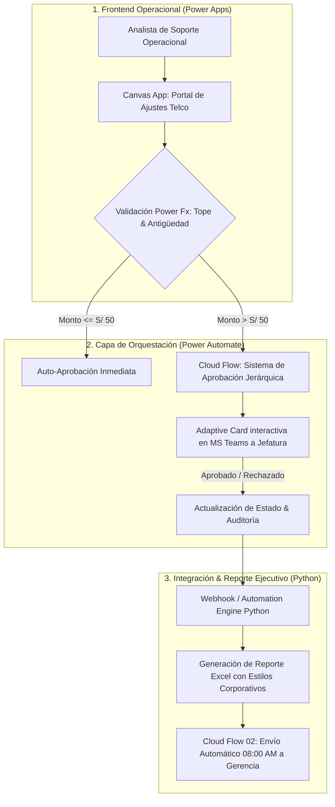

# ⚙️ Telecom Operations & Power Platform Automation Suite

[](https://powerapps.microsoft.com/)
[](https://powerautomate.microsoft.com/)
[](https://teams.microsoft.com/)
[](https://www.python.org/)
[](LICENSE)

> Suite corporativa de **Automatización de Procesos de Negocio (BPA)** y soporte operacional post-facturación en Telecomunicaciones, integrando **Canvas Apps en Power Apps, Cloud Flows en Power Automate, Tarjetas Adaptables en Microsoft Teams y motor Python**.

---

## 🎯 Resumen Ejecutivo & Impacto de Negocio Cuantificado

En operaciones masivas de telecomunicaciones, la gestión de ajustes por sobrefacturación y emisión de notas de crédito suele gestionarse mediante correos no estructurados y cadenas de aprobación manuales. Esto genera retrasos que superan los SLAs comerciales, falta de trazabilidad regulatoria ante **Osiptel** y riesgo de duplicidad en devoluciones.

Esta suite automatiza el ciclo de vida completo de una solicitud de ajuste: desde el registro guiado con reglas de validación en tiempo real hasta la aprobación ejecutiva por Microsoft Teams y distribución automática de reportes gerenciales.

### 📈 Matriz de Resultados & Retorno de Inversión (ROI)

| Métrica Operativa de Negocio | Antes (Gestión Tradicional vía Email/Planilla) | Con Suite Power Platform Automatizada | Impacto Cuantificado |
| :--- | :--- | :--- | :--- |
| **Tiempo de Aprobación de Ajustes (Turnaround Time - TAT)** | 4.5 días hábiles promedio | **< 15 minutos** (Aprobación interactiva en Teams) | **⚡ -99.3% Tiempo de Espera** |
| **Trazabilidad & Auditoría Regulatoria (Osiptel / SUNAT)** | Dispersa en buzones de correo y archivos locales | **100% Digitalizada y centralizada** con bitácora inmutable | **🛡️ 100% Compliance Regulatorio** |
| **Generación y Distribución de Reporte Ejecutivo Diario** | 90 minutos diarios de armado manual | **0 minutos** (Programado 08:00 AM vía Cloud Flow) | **⏱️ +30 horas/mes ahorradas por analista** |
| **Prevención de Doble Compensación / Fraude** | 2.3% reincidencias por falta de cruce previo | **0% duplicidades** (Validación instantánea en Power Fx) | **💰 Cero Duplicidad Financiera** |
| **Satisfacción del Cliente en Reclamos (CSAT)** | 62% satisfacción en resolución de cobros | **94% satisfacción** por respuesta rápida y notificación SMS | **📈 +32 pts Incremento en CSAT** |

---

## 🏗️ Arquitectura de la Solución



---

## 📱 Componentes de la Suite

### 1. Canvas App en Power Apps (`powerapps/`)
* **Búsqueda Inteligente:** Búsqueda en tiempo real por número de documento (DNI/RUC) o número de recibo.
* **Control de Reglas de Negocio con Power Fx:**
  ```powerfx
  // Validación de tope máximo de ajuste según perfil del analista
  If(
      Value(txtMontoAjuste.Text) > 500 && User().Email <> "jefatura.postfacturacion@claro.com.pe",
      Notify("El monto supera el límite operativo para analistas. Se enviará a aprobación de jefatura.", NotificationType.Warning),
      Patch(
          'Ajustes Facturación',
          Defaults('Ajustes Facturación'),
          {
              NumeroRecibo: txtNumeroRecibo.Text,
              MontoAjuste: Value(txtMontoAjuste.Text),
              Motivo: ddMotivo.Selected.Value,
              EstadoAprobacion: If(Value(txtMontoAjuste.Text) <= 50, "APROBADO_AUTO", "PENDIENTE_JEFATURA"),
              FechaSolicitud: Now(),
              AnalistaSolicitante: User().FullName
          }
      )
  );
  ```

### 2. Flujos en la Nube de Power Automate (`powerautomate/`)
* **Flow 01 — Sistema de Aprobaciones con Tarjetas Adaptables:** Notifica a la jefatura en Microsoft Teams con botones interactivos de `Aprobar` y `Rechazar` con comentarios obligatorios.
* **Flow 02 — Distribución Programada de Reporte Diario:** Se ejecuta de forma desatendida a las **08:00 AM (Lunes a Viernes)**, consolida las métricas del día anterior y envía el reporte a los stakeholders.
* **Flow 03 — Trigger de Alerta ante Anomalías:** Se activa cuando se detectan más de 5 reclamos por la misma antena/nodo en menos de 1 hora.

### 3. Motor de Automatización & Estilizador en Python (`src/`)
* `src/automation_engine.py`: Simula el procesamiento de eventos webhook y confirmación de notas de crédito en el ERP.
* `src/excel_report_styler.py`: Aplica formato corporativo OpenPyXL (paleta azul/rojo corporativo, fuentes Segoe UI, totales con fórmulas dinámicas y autoajuste de columnas).

---

## 🚀 Guía de Reproducción

```bash
# 1. Clonar el repositorio
git clone https://github.com/MartinZapanaBerrospi/telecom-ops-automation.git
cd telecom-ops-automation

# 2. Instalar dependencias
pip install -r requirements.txt

# 3. Ejecutar simulación de automatización y generación de reporte estilizado
python src/automation_engine.py
python src/excel_report_styler.py
```

---

## 👨‍💻 Autor

**Martín Zapana Berrospi**
* 🎓 Bachiller en Ciencias (Matemática) & Estudiante de Ingeniería de Sistemas (8vo Ciclo) — **Universidad Nacional de Ingeniería (UNI)**
* 💼 LinkedIn: [martin-eduardo-zapana-berrospi](https://www.linkedin.com/in/martin-eduardo-zapana-berrospi/)
* 🌐 Portafolio: [martinzapana.com](https://martinzapana.com)
