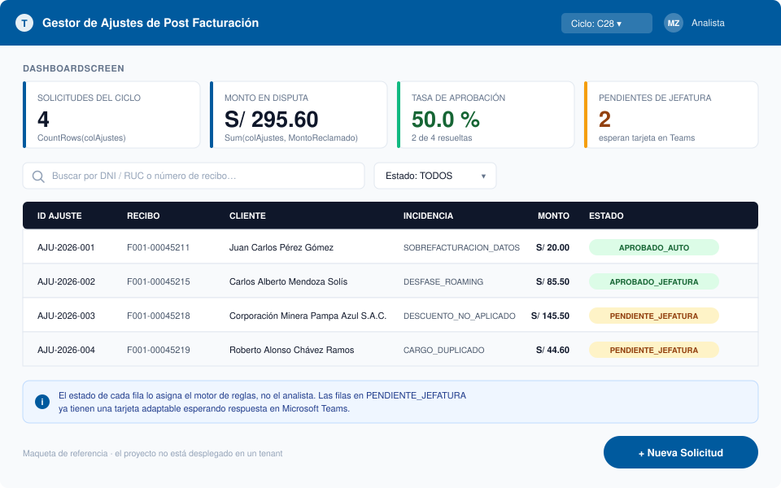
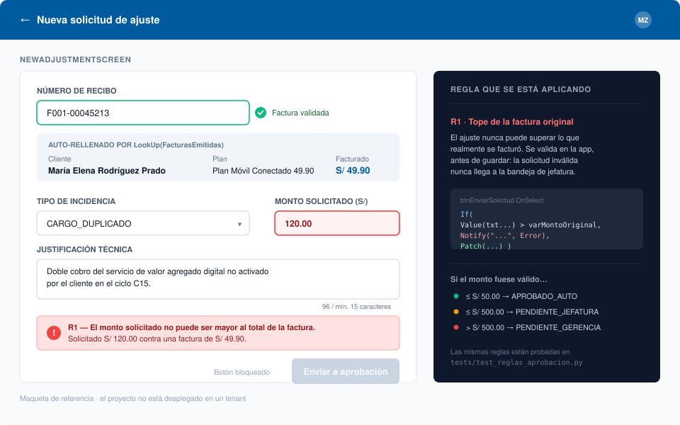
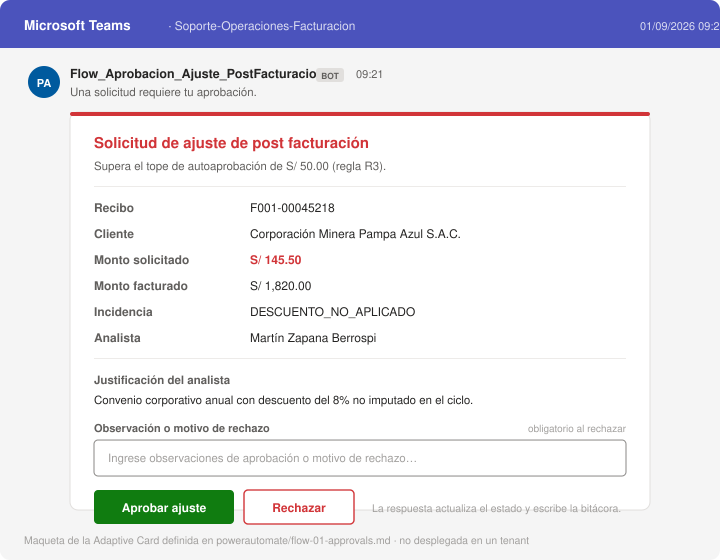
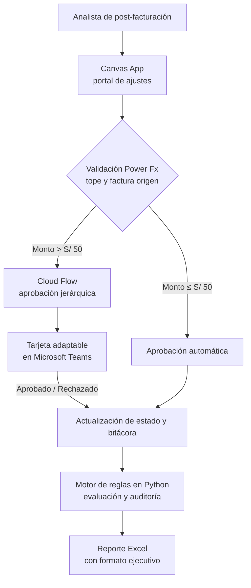

# Telecom Ops Automation

[](https://powerapps.microsoft.com/)
[](https://powerautomate.microsoft.com/)
[](https://www.python.org/)
[](tests/)
[](LICENSE)

Diseño de un flujo de **aprobación de ajustes de post-facturación** en telecomunicaciones
con Power Platform: una app de lienzo para el analista, un flujo de aprobación con tarjetas
adaptables en Teams y un motor de reglas en Python que implementa y prueba las mismas
validaciones.

> **Alcance.** Proyecto personal de aprendizaje. Los datos son **ficticios** (empresas,
> personas y documentos inventados). La app de Power Apps y los flujos de Power Automate
> están **especificados y versionados**, no desplegados en un tenant; lo que sí se ejecuta
> aquí es el motor de reglas en Python y su suite de pruebas.
> Ver [qué está implementado](#qué-está-implementado-y-qué-es-especificación).

---

## El problema que modela

Cuando un cliente reclama un cobro —sobrefacturación de datos, roaming no reconocido,
descuento no aplicado, cargo duplicado— el analista de post-facturación necesita registrar
el ajuste y conseguir una autorización. Hacerlo por cadenas de correo tiene tres problemas:
la decisión se pierde en bandejas, no queda bitácora de quién autorizó qué, y nada impide
aprobar un ajuste mayor que la propia factura.

Este proyecto modela ese proceso como un flujo con reglas explícitas y trazabilidad.

---

## Cómo se ve

Una Canvas App no se puede leer desde GitHub: el `.msapp` es un archivo comprimido y el
flujo vive en la nube. Por eso las pantallas están maquetadas en SVG, junto a los
diagramas, el código Power Fx y el motor ejecutable.

**Bandeja del analista** — cada solicitud con el estado que le asignó el motor de reglas:



**Registro de un ajuste** — la regla R1 bloqueando un monto mayor que la factura original,
antes de que la solicitud llegue a ninguna persona:



**Aprobación en Teams** — la tarjeta adaptable que recibe la jefatura cuando el monto supera
el tope de autoaprobación:



---

## Las reglas de negocio

Son el corazón del proyecto. Están definidas en
[`docs/01-business-rules.md`](docs/01-business-rules.md), validadas en la app con Power Fx,
ejecutadas por el flujo en la nube e implementadas y probadas en
[`src/automation_engine.py`](src/automation_engine.py):

| Regla | Condición | Resultado |
|---|---|---|
| **R1** | El ajuste supera el monto de la factura original | Rechazo automático |
| **R2** | Monto ≤ S/ 50.00 | Aprobación automática |
| **R3** | S/ 50.00 < monto ≤ S/ 500.00 | Aprobación de jefatura por tarjeta adaptable en Teams |
| **R4** | Monto > S/ 500.00 | Escala a gerencia |
| **R5** | El recibo no existe en el maestro de facturas | Rechazo automático |

Cada evaluación queda registrada en `data/BitacoraDecisiones.csv` con el dictamen, el
aprobador responsable y el motivo: la bitácora que el proceso por correo no tenía.

---

## Arquitectura



---

## Estructura del repositorio

Cada carpeta tiene su propio README con el detalle.

```
telecom-ops-automation/
├── docs/            Documentación y maquetas   → docs/README.md
│   ├── 01-business-rules.md      Las reglas R1–R5. Fuente de verdad del proyecto
│   ├── 02-data-model.md          Tablas, columnas y relaciones
│   ├── 03-deployment-guide.md    Cómo construirlo en un tenant y cómo mostrarlo
│   └── assets/                   Maquetas SVG de las pantallas y de la tarjeta
├── powerapps/       Canvas App                 → powerapps/README.md
│   ├── app-architecture.md       Pantallas, estado y paleta
│   ├── power-fx-formulas.md      Las fórmulas, una por propiedad de control
│   └── app-definition.json       Metadato: orígenes de datos y componentes
├── powerautomate/   Flujos en la nube          → powerautomate/README.md
│   ├── flow-01-approvals.md      Aprobación con tarjeta adaptable
│   ├── flow-02-scheduled-report.md
│   ├── flow-03-anomaly-alert.md
│   └── definitions/              Extractos de definición en JSON
├── src/             Código ejecutable          → src/README.md
│   ├── automation_engine.py      El motor de reglas
│   ├── generate_seed_data.py     Genera los datasets ficticios
│   └── excel_report_styler.py    Reporte con formato para jefatura
├── tests/           Pruebas de las reglas      → tests/README.md
└── data/            Datasets ficticios         → data/README.md
```

---

## Qué está implementado y qué es especificación

| Componente | Estado | Dónde |
|---|---|---|
| Motor de reglas de aprobación | **Código ejecutable** con 9 pruebas | [`src/automation_engine.py`](src/automation_engine.py), [`tests/`](tests/) |
| Generador de datos de prueba | **Código ejecutable** | [`src/generate_seed_data.py`](src/generate_seed_data.py) |
| Reporte Excel con formato | **Código ejecutable** | [`src/excel_report_styler.py`](src/excel_report_styler.py) |
| Canvas App (pantallas, estado, fórmulas) | Especificación y fórmulas Power Fx | [`powerapps/`](powerapps/) |
| Flujos de Power Automate (3) | Definiciones JSON y guías de implementación | [`powerautomate/`](powerautomate/) |
| Tarjeta adaptable para Teams | Payload JSON | [`powerautomate/flow-01-approvals.md`](powerautomate/flow-01-approvals.md) |
| Capturas de la app desplegada | **Pendiente** — requiere un tenant | [guía de despliegue](docs/03-deployment-guide.md) |

> **¿Y cómo se ve esto corriendo de verdad?** Estos `.md` y `.json` son planos: Power
> Platform no los importa. Lo que sí se importa es una *solución* `.zip` exportada desde
> un entorno, y con la Power Platform CLI esa solución se descomprime en archivos
> `.fx.yaml` con las fórmulas de cada pantalla, legibles en GitHub. El camino completo,
> con un entorno gratuito, está en la
> [Parte C de la guía de despliegue](docs/03-deployment-guide.md#parte-c--de-especificación-a-algo-que-corre-e-importa).

---

## Componentes

### Canvas App en Power Apps ([`powerapps/`](powerapps/))

Búsqueda por documento (DNI/RUC) o número de recibo, y validación reactiva del tope antes
de registrar el ajuste:

```powerfx
If(
    Value(txtMontoSolicitado.Text) <= 0 Or Value(txtMontoSolicitado.Text) > varMontoOriginal,
    Notify("El monto solicitado no puede ser mayor al total de la factura.", NotificationType.Error),
    Patch(
        AjustesPostFacturacion,
        Defaults(AjustesPostFacturacion),
        {
            NumeroRecibo:    txtNumeroRecibo.Text,
            MontoReclamado:  Value(txtMontoSolicitado.Text),
            TipoIncidencia:  drpTipoIncidencia.Selected.Value,
            EstadoReclamo:   If(Value(txtMontoSolicitado.Text) <= 50, "APROBADO_AUTO", "PENDIENTE_JEFATURA"),
            FechaRegistro:   Now(),
            UsuarioAnalista: varCurrentUser.Email
        }
    )
);
```

La arquitectura de pantallas y el modelo de estado están en
[`powerapps/app-architecture.md`](powerapps/app-architecture.md); el resto de fórmulas, en
[`powerapps/power-fx-formulas.md`](powerapps/power-fx-formulas.md).

### Flujos de Power Automate ([`powerautomate/`](powerautomate/))

| Flujo | Disparador | Qué hace |
|---|---|---|
| **01 — Aprobaciones** | Solicitud registrada en la app | Envía una tarjeta adaptable a la jefatura en Teams con botones de aprobar o rechazar y comentario obligatorio |
| **02 — Reporte programado** | Recurrencia, lunes a viernes 08:00 | Consolida las métricas del día anterior y distribuye el reporte a los responsables |
| **03 — Alerta por descuadre** | Webhook desde el pipeline de datos | Notifica cuando un ciclo cierra con más de 5% de descuadres |

### Motor de reglas y reportes en Python ([`src/`](src/))

- `automation_engine.py` — evalúa la bandeja de solicitudes contra las reglas R1–R5 y
  escribe la bitácora de decisiones.
- `excel_report_styler.py` — genera el reporte para jefatura con formato corporativo,
  calculado a partir de los datos del repositorio.
- `generate_seed_data.py` — crea los datasets ficticios de facturas y ajustes.

---

## Cómo ejecutarlo

Requisitos: Python 3.10 o superior.

```bash
git clone https://github.com/MartinZapanaBerrospi/telecom-ops-automation.git
cd telecom-ops-automation
pip install -r requirements.txt
```

```bash
python src/generate_seed_data.py     # 1. genera los datasets ficticios
python src/automation_engine.py      # 2. evalúa las solicitudes y escribe la bitácora
python src/excel_report_styler.py    # 3. genera el reporte Excel con formato
pytest tests/ -q                     # 4. valida las reglas de aprobación
```

El paso 2 imprime el dictamen de cada solicitud y deja la bitácora en
`data/BitacoraDecisiones.csv`.

**Para llevarlo a Power Platform**, la guía completa está en
[`docs/03-deployment-guide.md`](docs/03-deployment-guide.md): un
[Developer Plan](https://powerapps.microsoft.com/developerplan/) gratuito alcanza para
construir la app y los flujos, y contrastarlos contra el motor de Python.

---

## Criterios de diseño

Qué busca resolver cada decisión del flujo, frente a una cadena de correos:

| Criterio | Cómo se aborda |
|---|---|
| Que la decisión no se pierda | La aprobación ocurre dentro de Teams, donde la jefatura ya trabaja |
| Que no se aprueben montos imposibles | El tope y el monto de la factura original se validan antes de registrar la solicitud |
| Que quede rastro | Cada dictamen se escribe en una bitácora con usuario, fecha y motivo |
| Que las reglas sean verificables | Están implementadas en Python y cubiertas por pruebas, no sólo descritas en un documento |

---

## Limitaciones conocidas

- **No está desplegado en un tenant.** La app y los flujos son especificaciones y
  definiciones; no hay ambiente productivo ni licencias asociadas.
- **Los datos son ficticios.** Empresas, personas, documentos y montos fueron inventados
  para el ejercicio.
- **El motor de Python no conecta con Power Platform.** Reproduce las reglas de forma local
  para poder probarlas; no consume las APIs de Dataverse.
- **Los topes están fijos en el código.** En un sistema real vendrían de una tabla de
  parámetros editable por el negocio.
- **No hay escalamiento por tiempo.** Una solicitud puede quedar pendiente indefinidamente;
  ver [supuestos del modelo](docs/01-business-rules.md#6-supuestos-del-modelo).

---

## Autor

**Martín Zapana Berrospi** — Estudiante de Ingeniería de Sistemas (9no ciclo) y Bachiller
en Ciencias con mención en Matemática, Universidad Nacional de Ingeniería (UNI).

[Portafolio](https://www.martinzapana.com) · [LinkedIn](https://www.linkedin.com/in/martin-eduardo-zapana-berrospi/) · [GitHub](https://github.com/MartinZapanaBerrospi)
