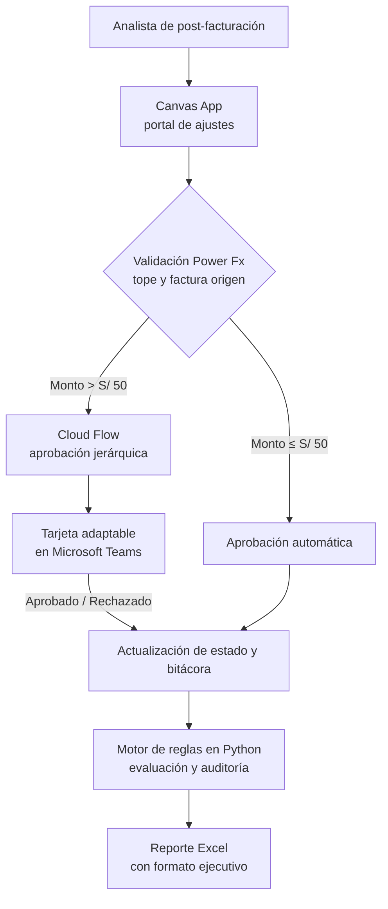

# Telecom Ops Automation

[](https://powerapps.microsoft.com/)
[](https://powerautomate.microsoft.com/)
[](https://www.python.org/)
[](tests/test_reglas_aprobacion.py)
[](LICENSE)

Diseño de un flujo de **aprobación de ajustes de post-facturación** en telecomunicaciones con Power Platform: una app de lienzo para el analista, un flujo de aprobación con tarjetas adaptables en Teams y un motor de reglas en Python que implementa y prueba las mismas validaciones.

> **Alcance del proyecto.** Es un proyecto personal de aprendizaje. Los datos son **ficticios** (empresas, personas y documentos inventados). La app de Power Apps y los flujos de Power Automate están **especificados y versionados como definiciones JSON y guías de implementación**, no desplegados en un tenant productivo; lo que sí se ejecuta en este repositorio es el motor de reglas en Python y su suite de pruebas. Ver [Qué está implementado](#qué-está-implementado-y-qué-es-especificación).

---

## El problema que modela

Cuando un cliente reclama un cobro (sobrefacturación de datos, roaming no reconocido, descuento no aplicado, cargo duplicado), el analista de post-facturación necesita registrar el ajuste y conseguir una autorización. Hacerlo por cadenas de correo tiene tres problemas: la decisión se pierde en bandejas, no queda bitácora de quién autorizó qué, y nada impide aprobar un ajuste mayor que la propia factura.

Este proyecto modela ese proceso como un flujo con reglas explícitas y trazabilidad.

---

## Las reglas de negocio

Son el corazón del proyecto. Están documentadas en [`docs/PROCESS_BLUEPRINT.md`](docs/PROCESS_BLUEPRINT.md), validadas en la app con Power Fx, ejecutadas por el flujo en la nube e implementadas y probadas en [`src/automation_engine.py`](src/automation_engine.py):

| Regla | Condición | Resultado |
|---|---|---|
| **R1** | El ajuste supera el monto de la factura original | Rechazo automático |
| **R2** | Monto ≤ S/ 50.00 | Aprobación automática |
| **R3** | S/ 50.00 < monto ≤ S/ 500.00 | Aprobación de jefatura por tarjeta adaptable en Teams |
| **R4** | Monto > S/ 500.00 | Escala a gerencia |
| **R5** | El recibo no existe en el maestro de facturas | Rechazo automático |

Cada evaluación queda registrada en `data/BitacoraDecisiones.csv` con el dictamen, el aprobador responsable y el motivo: la bitácora que el proceso por correo no tenía.

---

## Arquitectura



---

## Qué está implementado y qué es especificación

| Componente | Estado | Dónde |
|---|---|---|
| Motor de reglas de aprobación | **Código ejecutable** con 9 pruebas | [`src/automation_engine.py`](src/automation_engine.py), [`tests/`](tests/) |
| Generador de datos de prueba | **Código ejecutable** | [`src/generate_seed_data.py`](src/generate_seed_data.py) |
| Reporte Excel con formato | **Código ejecutable** | [`src/excel_report_styler.py`](src/excel_report_styler.py) |
| Canvas App (pantallas, estado, fórmulas) | Especificación y fórmulas Power Fx | [`powerapps/`](powerapps/) |
| Flujos de Power Automate (3) | Definiciones JSON y guías de implementación | [`powerautomate/`](powerautomate/) |
| Tarjetas adaptables para Teams | Payload JSON | [`powerautomate/flows_definitions/`](powerautomate/flows_definitions/) |

---

## Componentes

### Canvas App en Power Apps (`powerapps/`)

Búsqueda por documento (DNI/RUC) o número de recibo, y validación reactiva del tope antes de registrar el ajuste:

```powerfx
If(
    Value(txtMontoAjuste.Text) > 500 && User().Email <> "jefatura.postfacturacion@telecom.com",
    Notify("El monto supera el límite operativo para analistas. Se enviará a aprobación de jefatura.", NotificationType.Warning),
    Patch(
        'Ajustes Facturación',
        Defaults('Ajustes Facturación'),
        {
            NumeroRecibo: txtNumeroRecibo.Text,
            MontoAjuste: Value(txtMontoAjuste.Text),
            Motivo: ddMotivo.Selected.Value,
            EstadoAprobacion: If(Value(txtMontoAjuste.Text) <= 50, "APROBADO_AUTO", "PENDIENTE_JEFATURA"),
            FechaSolicitud: Now(),
            AnalistaSolicitante: User().FullName
        }
    )
);
```

La arquitectura de pantallas y el modelo de estado están en [`powerapps/APP_ARCHITECTURE.md`](powerapps/APP_ARCHITECTURE.md); el resto de fórmulas, en [`powerapps/POWER_FX_FORMULAS.md`](powerapps/POWER_FX_FORMULAS.md).

### Flujos de Power Automate (`powerautomate/`)

| Flujo | Disparador | Qué hace |
|---|---|---|
| **01 — Aprobaciones** | Solicitud registrada en la app | Envía una tarjeta adaptable a la jefatura en Teams con botones de aprobar o rechazar y comentario obligatorio |
| **02 — Reporte programado** | Recurrencia diaria | Consolida las métricas del día anterior y distribuye el reporte a los responsables |
| **03 — Alerta por anomalías** | Umbral de reclamos por nodo | Notifica cuando se concentran varios reclamos del mismo nodo en poco tiempo |

### Motor de reglas y reportes en Python (`src/`)

- `automation_engine.py`: evalúa la bandeja de solicitudes contra las reglas R1–R5 y escribe la bitácora de decisiones.
- `excel_report_styler.py`: genera el reporte para jefatura con formato corporativo (openpyxl).
- `generate_seed_data.py`: crea los datasets ficticios de facturas y ajustes.

---

## Cómo ejecutarlo

Requisitos: Python 3.10 o superior.

```bash
git clone https://github.com/MartinZapanaBerrospi/telecom-ops-automation.git
cd telecom-ops-automation
pip install -r requirements.txt
```

```bash
python src/generate_seed_data.py     # 1. genera los datasets ficticios
python src/automation_engine.py      # 2. evalúa las solicitudes y escribe la bitácora
python src/excel_report_styler.py    # 3. genera el reporte Excel con formato
pytest tests/ -q                     # 4. valida las reglas de aprobación
```

**Para llevarlo a Power Platform:** importa los datasets de `data/` como tablas en Dataverse o SharePoint, construye la app siguiendo `powerapps/APP_ARCHITECTURE.md` y crea los flujos en [make.powerautomate.com](https://make.powerautomate.com) con las definiciones de `powerautomate/`.

---

## Criterios de diseño

Qué busca resolver cada decisión del flujo, frente a una cadena de correos:

| Criterio | Cómo se aborda |
|---|---|
| Que la decisión no se pierda | La aprobación ocurre dentro de Teams, donde la jefatura ya trabaja |
| Que no se aprueben montos imposibles | El tope y el monto de la factura original se validan antes de registrar la solicitud |
| Que quede rastro | Cada dictamen se escribe en una bitácora con usuario, fecha y motivo |
| Que las reglas sean verificables | Están implementadas en Python y cubiertas por pruebas, no solo descritas en un documento |

---

## Limitaciones conocidas

- **No está desplegado en un tenant.** La app y los flujos son especificaciones y definiciones; no hay ambiente productivo ni licencias asociadas.
- **Los datos son ficticios.** Empresas, personas, documentos y montos fueron inventados para el ejercicio.
- **El motor de Python no conecta con Power Platform.** Reproduce las reglas de forma local para poder probarlas; no consume las APIs de Dataverse.

---

## Autor

**Martín Zapana Berrospi** — Estudiante de Ingeniería de Sistemas (9no ciclo) y Bachiller en Ciencias con mención en Matemática, Universidad Nacional de Ingeniería (UNI).

[Portafolio](https://www.martinzapana.com) · [LinkedIn](https://www.linkedin.com/in/martin-eduardo-zapana-berrospi/) · [GitHub](https://github.com/MartinZapanaBerrospi)
