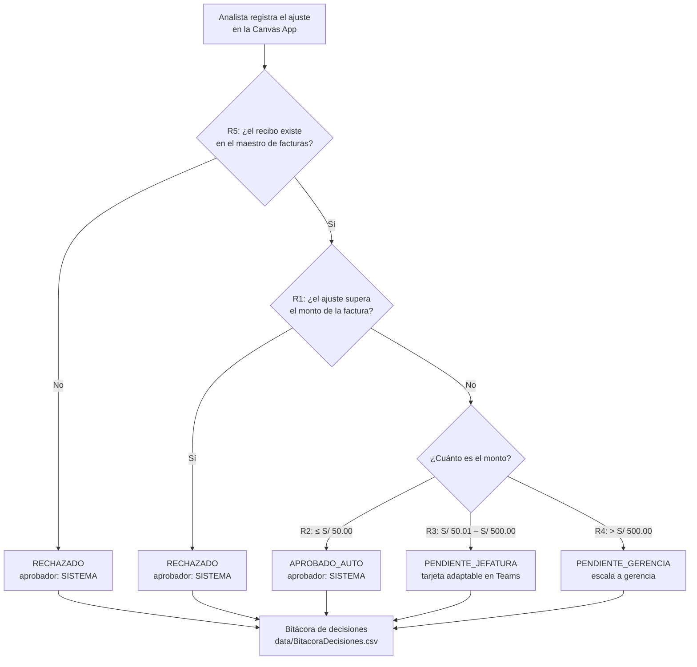
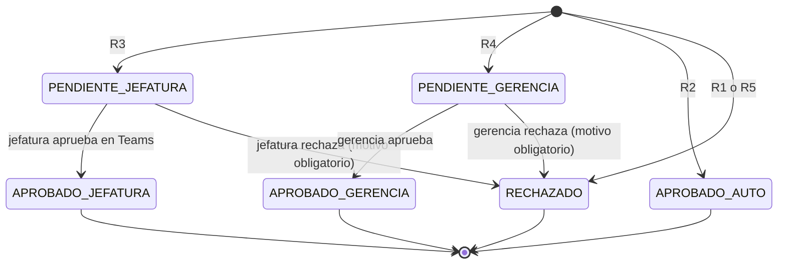

# Proceso y reglas de negocio

> Este documento es la **fuente de verdad** de las reglas del proyecto. La Canvas App,
> los flujos de Power Automate y el motor de Python implementan lo que aquí se define.
> Si una regla cambia, se cambia primero aquí y después en los tres lugares.

---

## 1. El proceso que se modela

Un cliente reclama un cobro de su recibo telefónico. Puede ser una sobrefacturación de
datos, un consumo de roaming que no reconoce, un descuento pactado que no se aplicó o un
cargo duplicado. El analista de post-facturación debe registrar el ajuste (la nota de
crédito) y conseguir que alguien con atribución lo autorice.

Hecho por correo, ese proceso tiene tres fallas:

| Falla | Consecuencia |
|---|---|
| La decisión vive en una bandeja de entrada | Se pierde, se responde tarde o se responde en un hilo paralelo |
| No queda bitácora estructurada | Nadie puede responder después "¿quién autorizó esto y por qué?" |
| No hay control de montos | Nada impide aprobar un ajuste mayor que la propia factura |

El diseño de este proyecto ataca esas tres fallas: la decisión ocurre donde la jefatura ya
trabaja (Teams), cada dictamen se escribe en una bitácora con responsable y motivo, y los
topes se validan **antes** de que la solicitud llegue a una persona.

---

## 2. Flujo completo

---

## 3. Las reglas

| Regla | Condición | Estado resultante | Aprobador responsable |
|---|---|---|---|
| **R1** | El ajuste supera el monto de la factura original | `RECHAZADO` | `SISTEMA` |
| **R2** | Monto ≤ **S/ 50.00** | `APROBADO_AUTO` | `SISTEMA` |
| **R3** | **S/ 50.00** < monto ≤ **S/ 500.00** | `PENDIENTE_JEFATURA` | `JEFATURA` |
| **R4** | Monto > **S/ 500.00** | `PENDIENTE_GERENCIA` | `GERENCIA` |
| **R5** | El recibo no existe en el maestro de facturas emitidas | `RECHAZADO` | `SISTEMA` |

Además de R1–R5, una validación de saneamiento: **un monto de cero o negativo se rechaza**
(`aprobador: SISTEMA`).

### Precisiones que importan al implementar

- **Los topes son inclusivos por abajo.** Exactamente S/ 50.00 se autoaprueba (R2);
  S/ 50.01 ya escala a jefatura. Exactamente S/ 500.00 es jefatura (R3); S/ 500.01 es
  gerencia (R4). Hay pruebas específicas para estos bordes.
- **El orden de evaluación no es negociable.** R5 antes que R1, y R1 antes que los topes:
  un ajuste de S/ 20.00 contra un recibo inexistente se rechaza por R5, no se autoaprueba
  por R2.
- **`PENDIENTE_*` no es una decisión final.** Marca que la solicitud espera a una persona.
  El motor de Python deja la solicitud en ese estado; quien resuelve es la jefatura o la
  gerencia desde la tarjeta adaptable en Teams.

### Dónde vive cada regla

| Implementación | Archivo |
|---|---|
| Validación en la app, antes de guardar | [`powerapps/power-fx-formulas.md`](../powerapps/power-fx-formulas.md) |
| Enrutamiento de la aprobación en la nube | [`powerautomate/flow-01-approvals.md`](../powerautomate/flow-01-approvals.md) |
| Motor ejecutable y auditable | [`src/automation_engine.py`](../src/automation_engine.py) |
| Pruebas de las reglas y de sus bordes | [`tests/test_reglas_aprobacion.py`](../tests/test_reglas_aprobacion.py) |

---

## 4. Estados de una solicitud

Los estados `APROBADO_JEFATURA` y `APROBADO_GERENCIA` los produce la respuesta humana en
Teams. El motor de Python de este repositorio llega hasta `PENDIENTE_*`: no simula la
decisión de la persona, porque inventarla anularía el sentido de la bitácora.

---

## 5. La bitácora

Cada corrida de `src/automation_engine.py` reescribe `data/BitacoraDecisiones.csv` con una
fila por solicitud evaluada:

| Columna | Significado |
|---|---|
| `id_ajuste` | Identificador de la solicitud (`AJU-2026-001`) |
| `numero_recibo` | Recibo reclamado (`F001-00045211`) |
| `monto_solicitado` | Monto del ajuste en soles |
| `estado` | Dictamen: `APROBADO_AUTO`, `PENDIENTE_JEFATURA`, `PENDIENTE_GERENCIA` o `RECHAZADO` |
| `aprobador` | Quién es responsable de ese dictamen: `SISTEMA`, `JEFATURA` o `GERENCIA` |
| `motivo` | Regla aplicada, en texto legible (`"R2: monto dentro del tope..."`) |
| `fecha_evaluacion` | Momento de la evaluación, en ISO 8601 |

Es un archivo generado: no se versiona (ver [`.gitignore`](../.gitignore)).

---

## 6. Supuestos del modelo

Se documentan porque delimitan hasta dónde llega el diseño:

- **Un ajuste por solicitud.** No se modelan ajustes parciales ni acumulación de varios
  reclamos sobre el mismo recibo.
- **El maestro de facturas es la autoridad del monto.** No se valida contra el sistema de
  tasación ni contra el detalle de consumo.
- **Los topes son constantes.** En un sistema real vendrían de una tabla de parámetros
  editable por el negocio, no de constantes en el código.
- **No hay vencimiento.** Una solicitud puede quedar en `PENDIENTE_*` indefinidamente; no
  se modela escalamiento por tiempo transcurrido.
