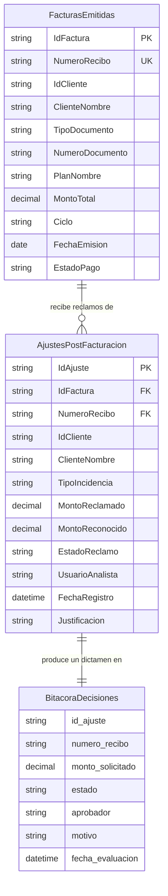

# Modelo de datos

Dos tablas de entrada y un archivo de salida. Los nombres de tabla y de columna que
aparecen aquí son los mismos que usan las fórmulas Power Fx, los flujos y el motor de
Python: si algo no coincide con esta página, esta página manda.



---

## `FacturasEmitidas` — maestro de facturas

Archivo: [`data/FacturasEmitidas.xlsx`](../data/FacturasEmitidas.xlsx) · hoja `Facturas` · 10 filas.

Es el maestro de solo lectura. Responde dos preguntas: **¿este recibo existe?** (regla R5)
y **¿cuánto se facturó?** (regla R1).

| Columna | Tipo | Ejemplo | Notas |
|---|---|---|---|
| `IdFactura` | Texto | `FAC-1001` | Clave primaria |
| `NumeroRecibo` | Texto | `F001-00045210` | Clave de búsqueda del analista. Formato `F001-########` |
| `IdCliente` | Texto | `CLI-801` | |
| `ClienteNombre` | Texto | `Minera Altoandina S.A.C.` | Ficticio |
| `TipoDocumento` | Texto | `RUC` / `DNI` | `RUC` para empresas, `DNI` para personas |
| `NumeroDocumento` | Texto | `20554896321` | Ficticio. **Texto, no número**: un RUC con cero inicial perdería el dígito |
| `PlanNombre` | Texto | `Plan Corporativo Móvil Ilimitado 120` | |
| `MontoTotal` | Decimal | `450.00` | Soles. Es el tope que R1 hace respetar |
| `Ciclo` | Texto | `C01`, `C15`, `C28` | Ciclo de facturación (corte del 01, 15 y 28) |
| `FechaEmision` | Fecha | `2026-08-01` | |
| `EstadoPago` | Texto | `EMITIDO` | |

---

## `AjustesPostFacturacion` — bandeja de solicitudes

Archivo: [`data/AjustesPostFacturacion.xlsx`](../data/AjustesPostFacturacion.xlsx) · hoja `Ajustes` · 4 filas.

Es la tabla transaccional: cada fila es un reclamo que un analista registró y que espera
un dictamen. En Power Platform es la tabla sobre la que la Canvas App hace `Patch()`.

| Columna | Tipo | Ejemplo | Notas |
|---|---|---|---|
| `IdAjuste` | Texto | `AJU-2026-001` | Clave primaria |
| `IdFactura` | Texto | `FAC-1002` | → `FacturasEmitidas.IdFactura` |
| `NumeroRecibo` | Texto | `F001-00045211` | → `FacturasEmitidas.NumeroRecibo`. Es el campo por el que el motor cruza las tablas |
| `IdCliente` | Texto | `CLI-802` | Denormalizado desde la factura |
| `ClienteNombre` | Texto | `Juan Carlos Pérez Gómez` | Denormalizado, para no hacer `LookUp` en cada fila de la galería |
| `TipoIncidencia` | Texto | `SOBREFACTURACION_DATOS` | Ver catálogo abajo |
| `MontoReclamado` | Decimal | `20.00` | Lo que pide el cliente. **Es el monto que evalúan las reglas** |
| `MontoReconocido` | Decimal | `20.00` | Lo que finalmente se aprobó. `0.00` mientras esté pendiente |
| `EstadoReclamo` | Texto | `PENDIENTE_JEFATURA` | Ver [estados](01-business-rules.md#4-estados-de-una-solicitud) |
| `UsuarioAnalista` | Texto | `analista.ops@telecom.com` | Quién registró la solicitud |
| `FechaRegistro` | Fecha y hora | `2026-08-05 10:15:00` | |
| `Justificacion` | Texto largo | `Cargo indebido por paquete...` | La app exige un mínimo de caracteres |

### Catálogo de `TipoIncidencia`

| Valor | Qué reclama el cliente |
|---|---|
| `SOBREFACTURACION_DATOS` | Consumo de datos cobrado por encima de lo real o de lo contratado |
| `DESFASE_ROAMING` | Roaming tarificado mal, típicamente en zona de frontera |
| `DESCUENTO_NO_APLICADO` | Un descuento pactado por convenio que no se imputó al ciclo |
| `CARGO_DUPLICADO` | El mismo concepto cobrado dos veces |
| `FALLA_TECNICA` | Servicio interrumpido y cobrado igual |

---

## `BitacoraDecisiones` — salida auditable

Archivo: `data/BitacoraDecisiones.csv` · **generado**, no versionado.

Lo escribe `src/automation_engine.py` en cada corrida, con una fila por solicitud
evaluada. Sus columnas están en
[las reglas de negocio, sección 5](01-business-rules.md#5-la-bitácora).

Usa `snake_case` mientras las tablas de entrada usan `PascalCase`. No es un descuido: las
tablas de entrada son el contrato con Power Platform, que nombra así sus columnas; la
bitácora es salida de Python y sigue la convención de Python.

---

## Cómo se regeneran los datos

Los dos `.xlsx` de entrada están versionados para que se puedan abrir sin ejecutar nada,
pero se reconstruyen desde el código en cualquier momento:

```bash
python src/generate_seed_data.py
```

Los datos son ficticios. Empresas, personas, documentos de identidad y montos fueron
inventados para el ejercicio y no corresponden a ningún cliente real.
