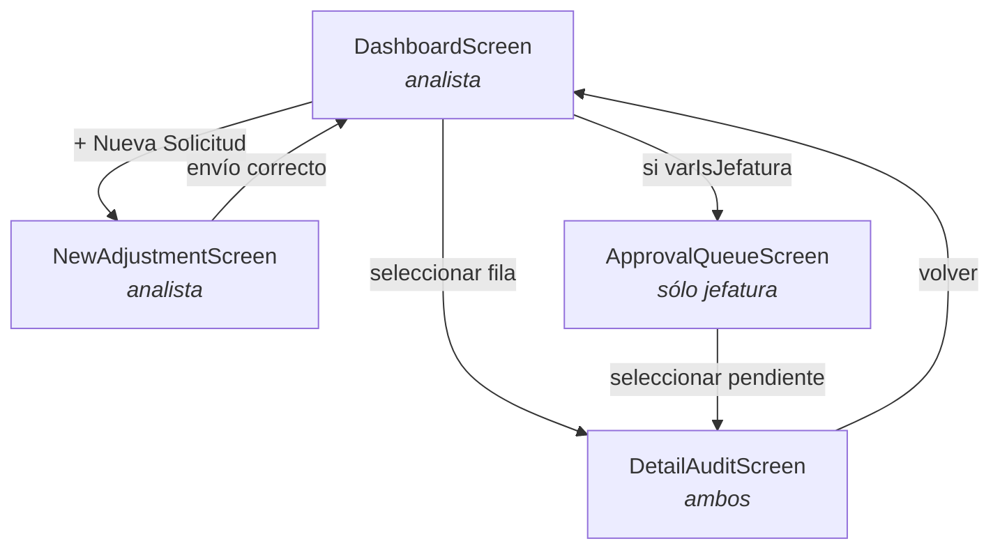

# Arquitectura de la Canvas App

**Nombre:** `TelecomPostBillingAdjustmentManager`
**Formato:** tableta (horizontal)
**Metadato:** [`app-definition.json`](app-definition.json)

Permite al analista de post-facturación registrar y someter a aprobación solicitudes de
ajuste —notas de crédito, cargos duplicados, devoluciones por interrupción del servicio y
reclamos de datos móviles— con validación en tiempo real y disparo del flujo de aprobación.

---

## Navegación entre pantallas

El acceso a `ApprovalQueueScreen` depende de `varIsJefatura`, que se resuelve en
`App.OnStart` contra el grupo de seguridad `M365_Jefatura_PostFacturacion`.

---

## Pantallas

### `DashboardScreen` — principal

Maqueta: [`docs/assets/app-dashboard.svg`](../docs/assets/app-dashboard.svg)

- **Cabecera corporativa:** logo, usuario activo y selector de ciclo (`C01`, `C15`, `C28`).
- **Tarjetas de KPI del ciclo:**

  | Indicador | Fórmula |
  |---|---|
  | Solicitudes del ciclo | `CountRows(colAjustes)` |
  | Monto en disputa (S/) | `Sum(colAjustes, MontoReclamado)` |
  | Tasa de aprobación | Resueltas sobre el total |
  | Pendientes de jefatura | `CountRows(Filter(colAjustes, EstadoReclamo = "PENDIENTE_JEFATURA"))` |

- **Galería `galAjustes`:** filtrable por estado y con buscador por DNI/RUC o número de
  recibo. Cada fila muestra su estado con un distintivo de color.
- **Botón flotante:** `+ Nueva Solicitud` → `NewAdjustmentScreen`.

### `NewAdjustmentScreen` — registro

Maqueta: [`docs/assets/app-new-adjustment.svg`](../docs/assets/app-new-adjustment.svg)

- **Buscador de factura.** `txtNumeroRecibo` valida el formato `F001-########` y, al
  cambiar, hace `LookUp()` sobre `FacturasEmitidas` para auto-rellenar cliente, plan y
  monto facturado.
- **Campos del formulario:**

  | Control | Tipo | Validación |
  |---|---|---|
  | `drpTipoIncidencia` | Desplegable | Del [catálogo de incidencias](../docs/02-data-model.md#catálogo-de-tipoincidencia) |
  | `txtMontoSolicitado` | Número | Mayor que cero y no mayor que `varMontoOriginal` |
  | `txtJustificacion` | Texto multilínea | Mínimo 15 caracteres |
  | Adjunto de evidencia | Attachment | Opcional |

- **Validación dinámica.** Si el monto supera la factura original, aparece un banner rojo y
  el botón de envío queda bloqueado. Es la **regla R1** actuando antes de guardar: la
  solicitud inválida nunca llega a la bandeja de la jefatura.

### `ApprovalQueueScreen` — bandeja de jefatura

- **Control de acceso:** visible sólo si `varIsJefatura` es verdadero.
- **Acciones:** aprobar (actualiza estado y `MontoReconocido`) o rechazar (exige motivo).
- Es la alternativa dentro de la app a la tarjeta adaptable en Teams. Ambas escriben el
  mismo dictamen; la tarjeta existe porque la jefatura no siempre abre la app.

### `DetailAuditScreen` — trazabilidad

Historial completo de una solicitud: quién la registró, con qué justificación, qué regla se
aplicó, quién decidió y cuándo. Es la pantalla que responde la pregunta *"¿quién autorizó
esto?"*, que es precisamente lo que el proceso por correo no podía responder.

---

## Modelo de estado

| Variable | Alcance | Se fija en | Contiene |
|---|---|---|---|
| `varCurrentUser` | Global | `App.OnStart` | `User()`: nombre, correo, foto |
| `varIsJefatura` | Global | `App.OnStart` | Si el usuario puede aprobar |
| `colAjustes` | Colección | `App.OnStart` | Copia local de `AjustesPostFacturacion` |
| `colCiclos` | Colección | `App.OnStart` | Catálogo fijo de ciclos (`C01`, `C15`, `C28`) |
| `varFacturaEncontrada` | Global | `txtNumeroRecibo.OnChange` | Registro completo de la factura buscada |
| `varMontoOriginal` | Contexto | `txtNumeroRecibo.OnChange` | `MontoTotal` de la factura: el tope de R1 |
| `varFacturaValida` | Contexto | `txtNumeroRecibo.OnChange` | Si el recibo existe (regla R5) |

Las fórmulas completas están en [`power-fx-formulas.md`](power-fx-formulas.md).

---

## Paleta de colores

| Rol | Color | Hex |
|---|---|---|
| Primario | Azul corporativo | `#005A9E` |
| Secundario | Azul profundo | `#0F172A` |
| Fondo | Gris muy claro | `#F8FAFC` |
| Bordes | Gris claro | `#E2E8F0` |
| Éxito | Verde | `#10B981` (fondo `#DCFCE7`, texto `#166534`) |
| Advertencia | Ámbar | `#F59E0B` (fondo `#FEF3C7`, texto `#92400E`) |
| Error | Rojo | `#EF4444` (fondo `#FEE2E2`, texto `#991B1B`) |

Los tres últimos son los colores de los distintivos de estado: verde para `APROBADO_*`,
ámbar para `PENDIENTE_*`, rojo para `RECHAZADO`. La misma paleta la usa el reporte Excel de
[`src/excel_report_styler.py`](../src/excel_report_styler.py).
