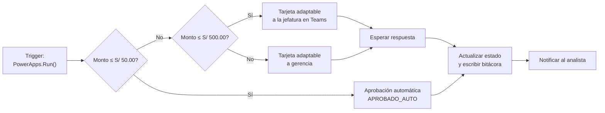

# Flujos de Power Automate

Tres flujos en la nube. El primero es el corazón del proyecto: convierte una solicitud de
ajuste en una decisión trazable. Los otros dos son de operación diaria.

> **Estado: especificación.** Los flujos no están creados en ningún tenant. Lo que hay
> aquí son sus disparadores, su lógica y sus payloads, en detalle suficiente para
> reconstruirlos. Ver [cómo crearlos](../docs/03-deployment-guide.md#b3--crear-los-flujos).

---

## Los tres flujos

| # | Flujo | Disparador | Documento |
|---|---|---|---|
| **01** | `Flow_Aprobacion_Ajuste_PostFacturacion` | La Canvas App, al registrar una solicitud | [`flow-01-approvals.md`](flow-01-approvals.md) |
| **02** | `Flow_Distribucion_Diaria_Reporte_Operacional` | Recurrencia, lunes a viernes 08:00 (hora de Lima) | [`flow-02-scheduled-report.md`](flow-02-scheduled-report.md) |
| **03** | `Flow_Alerta_Descuadre_Ciclo` | Webhook HTTP desde el pipeline de datos | [`flow-03-anomaly-alert.md`](flow-03-anomaly-alert.md) |

### 01 · Aprobación de ajustes

El único que implementa reglas de negocio. Recibe la solicitud, la enruta según el monto y
espera la decisión humana cuando hace falta:

Los topes de S/ 50.00 y S/ 500.00 son las reglas R2, R3 y R4 de
[`docs/01-business-rules.md`](../docs/01-business-rules.md). **Son los mismos valores que
valida la app y que prueba el motor de Python**: si cambias uno, cámbialos todos.

### 02 · Reporte programado

Sin reglas de negocio: consolida los indicadores del día anterior, arma un correo HTML con
el Excel adjunto y publica el resumen en el canal de operaciones. El Excel es el que
genera [`src/excel_report_styler.py`](../src/excel_report_styler.py).

### 03 · Alerta por descuadre

Disparador webhook. Cuando el pipeline de datos detecta que un ciclo tiene más de 5% de
descuadres, envía un POST y el flujo notifica al analista de guardia. Es el único flujo
que **no** parte de una acción del usuario.

---

## `definitions/`

| Archivo | Flujo |
|---|---|
| [`approval-flow.json`](definitions/approval-flow.json) | Lógica de enrutamiento por monto del flujo 01 |
| [`report-distribution-flow.json`](definitions/report-distribution-flow.json) | Disparador de recurrencia del flujo 02 |

Son **extractos de definición** en el esquema de workflows de Azure Logic Apps, el mismo
que usa Power Automate por debajo. Sirven para leer la lógica y para reconstruirla con
precisión.

> **No se importan directamente en Power Automate.** Un flujo importable es una solución
> `.zip` exportada desde un entorno, con conexiones y referencias resueltas; eso sólo
> existe después de construir el flujo. El flujo 03 no tiene definición JSON porque su
> lógica cabe entera en su documento.

---

## Cuentas y canales de ejemplo

Los documentos usan destinatarios ficticios que hay que reemplazar al construir los flujos:

| Valor de ejemplo | Qué es |
|---|---|
| `jefatura.postfacturacion@telecom.com` | Aprobador de nivel jefatura |
| `supervisor.ops@telecom.com` | Aprobador alterno |
| `analista.ops@telecom.com` | Solicitante |
| `#Soporte-Operaciones-Facturacion` | Canal de Teams donde se publican avisos |
